# UML Class Diagram — MediTrack

> Rendered with Mermaid. View in any Mermaid-compatible renderer (GitHub, VS Code Mermaid plugin, mermaid.live).

```mermaid
classDiagram
    %% ─── Serializable marker ───────────────────────────────────────────────
    class Serializable {
        <<interface>>
    }

    %% ─── Core entity hierarchy ──────────────────────────────────────────────
    class MedicalEntity {
        <<abstract>>
        -String id
        -LocalDateTime createdAt
        -LocalDateTime updatedAt
        -DateTimeProvider dateTimeProvider
        +getEntityType() String
        +getId() String
        +getCreatedAt() LocalDateTime
        +getUpdatedAt() LocalDateTime
        +getAuditInfo() String
        #markUpdated() void
    }
    MedicalEntity ..|> Serializable

    class Person {
        <<abstract>>
        -String name
        -LocalDate dateOfBirth
        -String email
        -String phone
        +getRole() String
        +updateName(String) void
        +updateContactInfo(String, String) void
        +getDisplayInfo() String
        +getAge() int
    }
    Person --|> MedicalEntity

    class Doctor {
        -Specialization specialization
        -double consultationFee
        -Set~WeekDay~ workingDays
        -List~LocalDate~ leaveDates
        +create(String, String, LocalDate, String, String, Specialization, double) Doctor$
        +createWithSchedule(...) Doctor$
        +isAvailableOn(LocalDate) boolean
        +updateConsultationFee(double) void
        +addLeave(LocalDate) void
    }
    Doctor --|> Person

    class Patient {
        -BloodGroup bloodGroup
        -List~String~ medicalHistory
        -List~String~ appointmentIds
        -EmergencyContact emergencyContact
        +create(...) Patient$
        +addMedicalHistory(String) void
        +updateEmergencyContact(EmergencyContact) void
        +clone() Patient
        +deepClone() Patient
    }
    Patient --|> Person
    Patient ..|> Cloneable

    class EmergencyContact {
        -String name
        -String phone
        -String relationship
    }
    EmergencyContact ..|> Serializable
    Patient "1" *-- "1" EmergencyContact

    %% ─── Appointment ────────────────────────────────────────────────────────
    class Appointment {
        -String patientId
        -String doctorId
        -LocalDate appointmentDate
        -LocalTime appointmentTime
        -AppointmentStatus status
        -String reason
        -List~String~ notes
        +create(...) Appointment$
        +confirm() void
        +cancel() void
        +complete() void
        +markBillPaid() void
        +reschedule(LocalDate, LocalTime) void
        +addNote(String) void
        +clone() Appointment
        +deepClone() Appointment
    }
    Appointment --|> MedicalEntity
    Appointment ..|> Cloneable

    %% ─── Bill ───────────────────────────────────────────────────────────────
    class Bill {
        -String appointmentId
        -double baseAmount
        -BillingStrategy strategy
        -boolean paid
        +Builder builder()$
        +calculateTotal() double
        +markAsPaid() void
    }
    Bill --|> MedicalEntity

    class BillSummary {
        -String billId
        -String appointmentId
        -double totalAmount
        -String strategyName
        -LocalDateTime generatedAt
    }
    BillSummary ..|> Serializable
    Bill "1" ..> "1" BillSummary : produces

    %% ─── Enums ──────────────────────────────────────────────────────────────
    class AppointmentStatus {
        <<enumeration>>
        PENDING
        CONFIRMED
        COMPLETED
        PAID
        CANCELLED
        +canTransitionTo(AppointmentStatus) boolean
        +getDisplayName() String
    }
    Appointment --> AppointmentStatus

    class BloodGroup {
        <<enumeration>>
        A_POSITIVE
        A_NEGATIVE
        B_POSITIVE
        B_NEGATIVE
        O_POSITIVE
        O_NEGATIVE
        AB_POSITIVE
        AB_NEGATIVE
    }
    Patient --> BloodGroup

    class Specialization {
        <<enumeration>>
        CARDIOLOGY
        DERMATOLOGY
        NEUROLOGY
        ORTHOPEDICS
        PEDIATRICS
        GENERAL_PRACTICE
    }
    Doctor --> Specialization

    class BillType {
        <<enumeration>>
        STANDARD
        SENIOR_CITIZEN
        INSURANCE
        EMERGENCY
    }
    Bill --> BillType

    %% ─── Billing Strategy (Strategy Pattern) ────────────────────────────────
    class BillingStrategy {
        <<interface>>
        +calculate(Bill) double
        +getStrategyName() String
    }
    BillingStrategy --|> Serializable

    class StandardBillingStrategy {
        +calculate(Bill) double
        +getStrategyName() String
    }
    class SeniorCitizenBillingStrategy {
        +calculate(Bill) double
        +getStrategyName() String
    }
    class InsuranceBillingStrategy {
        +calculate(Bill) double
        +getStrategyName() String
    }
    class EmergencyBillingStrategy {
        +calculate(Bill) double
        +getStrategyName() String
    }
    StandardBillingStrategy ..|> BillingStrategy
    SeniorCitizenBillingStrategy ..|> BillingStrategy
    InsuranceBillingStrategy ..|> BillingStrategy
    EmergencyBillingStrategy ..|> BillingStrategy
    Bill --> BillingStrategy

    %% ─── Service Interfaces ─────────────────────────────────────────────────
    class DoctorService {
        <<interface>>
        +register(Doctor) void
        +findById(String) Doctor
        +findAll() List~Doctor~
        +importDoctor(Doctor) void
    }
    class PatientService {
        <<interface>>
        +register(Patient) void
        +findById(String) Patient
        +findAll() List~Patient~
        +importPatient(Patient) void
    }
    class AppointmentService {
        <<interface>>
        +bookAppointment(...) Appointment
        +confirmAppointment(String) void
        +cancelAppointment(String) void
        +completeAppointment(String) void
        +finalizeAndPay(String, Bill) void
        +findById(String) Appointment
        +importAppointment(Appointment) void
        +addObserver(AppointmentObserver) void
    }
    class AnalyticsService {
        <<interface>>
        +getTotalAppointments() int
        +getAppointmentsByStatus(AppointmentStatus) List~Appointment~
        +getTotalRevenue() double
        +getMostBusyDoctor() Optional~Doctor~
    }

    %% ─── Service Implementations ────────────────────────────────────────────
    class DoctorServiceImpl {
        -InMemoryStore~Doctor~ doctorStore
    }
    class PatientServiceImpl {
        -InMemoryStore~Patient~ patientStore
    }
    class AppointmentServiceImpl {
        -InMemoryStore~Appointment~ appointmentStore
        -DoctorService doctorService
        -PatientService patientService
        -CopyOnWriteArrayList~AppointmentObserver~ observers
        -notifyObservers(Appointment, String) void
    }
    class AnalyticsServiceImpl {
        -AppointmentService appointmentService
        -DoctorService doctorService
    }

    DoctorServiceImpl ..|> DoctorService
    PatientServiceImpl ..|> PatientService
    AppointmentServiceImpl ..|> AppointmentService
    AnalyticsServiceImpl ..|> AnalyticsService
    AppointmentServiceImpl --> DoctorService
    AppointmentServiceImpl --> PatientService

    %% ─── Observer Pattern ────────────────────────────────────────────────────
    class AppointmentObserver {
        <<interface>>
        +onAppointmentChanged(Appointment, String) void
    }
    class ConsoleNotificationObserver {
        +onAppointmentChanged(Appointment, String) void
    }
    ConsoleNotificationObserver ..|> AppointmentObserver
    AppointmentServiceImpl "1" o-- "*" AppointmentObserver

    %% ─── Template Method Pattern ─────────────────────────────────────────────
    class BillGenerationTemplate {
        <<abstract>>
        +generate(Appointment, double, BillType) Bill
        #validateAppointment(Appointment) void
        #createBill(Appointment, double, BillType) Bill
        #applyStrategy(Bill) void
        #postProcess(Bill) void
    }
    class AppointmentCompletionTemplate {
        <<abstract>>
        +complete(String) void
        #validateAppointment(Appointment) void
        #performCompletion(Appointment) void
        #postComplete(Appointment) void
    }

    %% ─── Singletons & Utilities ──────────────────────────────────────────────
    class IdGenerator {
        -IdGenerator INSTANCE$
        -AtomicInteger counter
        +getInstance() IdGenerator$
        +nextId(String) String
    }

    class AppConfig {
        -volatile AppConfig instance$
        -Properties properties
        +getInstance() AppConfig$
        +get(String) String
        +getInt(String, int) int
    }

    class DateUtil {
        -AtomicReference~DateTimeProvider~ dateTimeProvider$
        +calculateAge(LocalDate) int
        +format(LocalDate) String
        +setDateTimeProvider(DateTimeProvider) void$
    }

    class SerializationUtil {
        +serialize(Serializable, String) void$
        +deserialize(String) T$
    }

    class CSVPersistence {
        +saveDoctors(List~Doctor~) void$
        +savePatients(List~Patient~) void$
        +loadDoctors(DoctorService) void$
        +loadPatients(PatientService) void$
    }

    %% ─── DateTimeProvider ────────────────────────────────────────────────────
    class DateTimeProvider {
        <<interface>>
        +today() LocalDate
        +now() LocalDateTime
    }
    DateTimeProvider --|> Serializable

    class SystemDateTimeProvider {
        -SystemDateTimeProvider INSTANCE$
        +getInstance() SystemDateTimeProvider$
        +today() LocalDate
        +now() LocalDateTime
    }
    SystemDateTimeProvider ..|> DateTimeProvider

    %% ─── Concurrency ─────────────────────────────────────────────────────────
    class AppointmentReminderScheduler {
        -ScheduledExecutorService scheduler
        -AtomicInteger scheduledCount
        +scheduleReminder(Appointment) void
        +shutdown() void
    }
    class AppointmentReminderTask {
        -Appointment appointment
        +run() void
    }
    AppointmentReminderTask ..|> Runnable
    AppointmentReminderScheduler --> AppointmentReminderTask

    %% ─── Exceptions ──────────────────────────────────────────────────────────
    class InvalidDataException {
        -String field
        +InvalidDataException(String, String)
    }
    class AppointmentNotFoundException {
        +AppointmentNotFoundException(String)
    }
    class DataPersistenceException {
        +DataPersistenceException(String, String, Throwable)
    }
```

## Key Design Patterns Visualized

| Pattern | Participants |
|---------|-------------|
| **Strategy** | `BillingStrategy` ← `StandardBillingStrategy`, `SeniorCitizenBillingStrategy`, `InsuranceBillingStrategy`, `EmergencyBillingStrategy` |
| **Template Method** | `BillGenerationTemplate`, `AppointmentCompletionTemplate` |
| **Observer** | `AppointmentObserver` ← `ConsoleNotificationObserver`; notified by `AppointmentServiceImpl` |
| **Singleton (Eager)** | `IdGenerator` — static block initialization |
| **Singleton (Lazy)** | `AppConfig` — double-checked locking |
| **Factory Method** | `BillFactory.create()`, `Doctor.create()`, `Patient.create()`, `Appointment.create()` |
| **Builder** | `Bill.Builder` |
